<table>
<tr>
<td valign="top"></td>
<td valign="top"></td>
</tr>
</table>

## Sahil Kumar

**B.Tech CCE @ Manipal University Jaipur · Web Dev Head @ ACM SIGBED · Competitive Programmer**

 

 

<!-- animated contribution graph, refreshed daily by the workflow -->

 
 

<!-- real top-languages breakdown across public repos, refreshed daily -->

